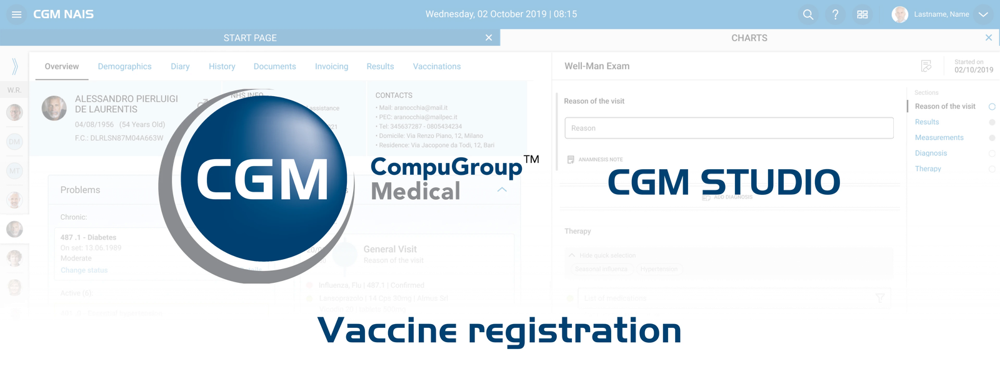

# CGM Vaccine Registration

## Overview

In this project, the primary goal was to develop and integrate a vaccine registration function into an existing physician software platform, a leading **B2B SaaS product used by medical professionals**. This new feature was designed to connect directly with the online medical service of the local Lazio ASL—one of the most sophisticated administrative healthcare systems in Italy, which utilizes intricate API services. The integration aimed to streamline the vaccination registration process, making it more efficient and compliant with **Italian healthcare regulations**.

## Case Study Preview

## Key details

This project was not only crucial for **streamlining the vaccination** process during the critical times of the **COVID-19 pandemic** but also essential for ensuring compliance with healthcare standards. The initiative directly supported medical professionals by providing a tool that significantly enhanced their ability to **manage public health responsibilities** effectively.

#### Target Audience

The system is primarily designed for medical professionals who require a reliable and efficient tool to register vaccinations directly into regional healthcare databases. This audience values accuracy, compliance, and ease of use in their daily operations.

#### Complex regulatory requirements

The design needed to adhere to stringent Italian healthcare regulations, ensuring that all data handling is secure and compliant.

#### Diverse vaccine information

The system had to accommodate a wide range of vaccines, each with its specific data requirements and potential edge cases.

#### Technical integration challenges

Integrating the new function into an existing software environment required careful architectural considerations to maintain system stability and performance.

## Prototype and wireframes

Click on the prototype button to have a quick walkthrough a typical vaccination registration.

Follow the highlights and complete a vaccine registration.

## My role in the process

#### Regulatory expertise

I took on the challenge of mastering the intricate Italian healthcare laws, which are essential for ensuring the vaccine registration function adhered to all legal standards. This required a thorough study of ongoing legislative updates and a proactive approach to incorporating these requirements into the design.

#### Stakeholder collaboration

My responsibilities extended beyond design; I facilitated crucial discussions with legal experts and translated their guidance into practical design solutions. This collaboration ensured that every aspect of the product was compliant and aligned with medical and legal standards.

#### Design adaptability

I focused on creating a design that was not only intuitive for users but also flexible enough to adapt to legal requirements as they evolved. This involved designing interfaces that could easily be updated or modified without significant disruptions to the user experience or backend architecture.

#### Proactive Compliance Strategy

I designed with foresight, anticipating potential regulatory changes and preparing the system architecture to accommodate these adjustments efficiently. This strategic planning was crucial for minimizing future risks and maintaining the software's leadership in compliance within the Italian market.

## Outcomes

#### Streamlined registration process

Enhanced the efficiency of vaccine registration for medical professionals, significantly improving user experience.

#### Regulatory compliance

Ensured full compliance with Italian healthcare laws, vital for legal operation and user trust.

#### Market expansion

Facilitated broader adoption and rollout in Italy and other markets, strengthening the software's industry position.

## Learnings

Through this project, I deepened my understanding of the critical role of stakeholder collaboration and regulatory compliance in healthcare software design. Successfully navigating the complex Italian healthcare regulations has not only improved my strategic planning and problem-solving skills but also enhanced my technical proficiency in working within rigorous design systems. These experiences have equipped me with invaluable skills and insights that will guide my approach to future UX/UI projects, particularly in regulated industries.

Thank you for reading all the way to the end! If you want to know more or you would like to chat click on the button to the right and get in touch.
