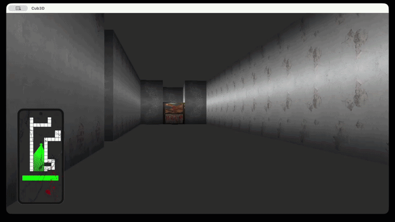
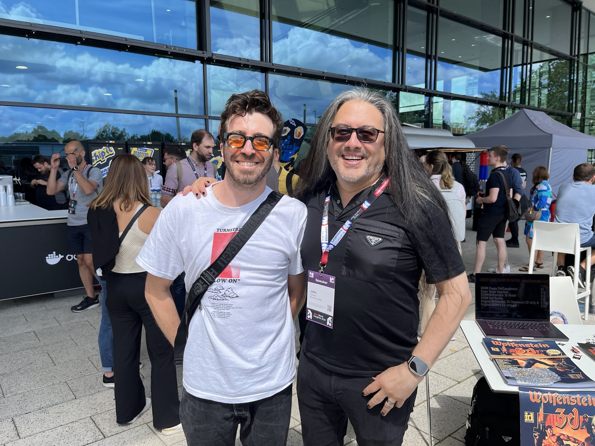
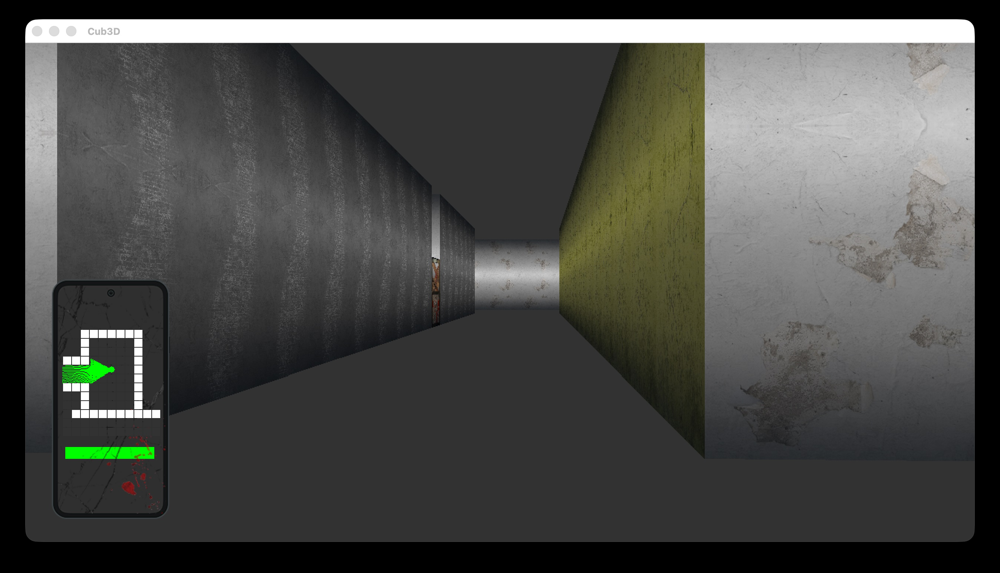
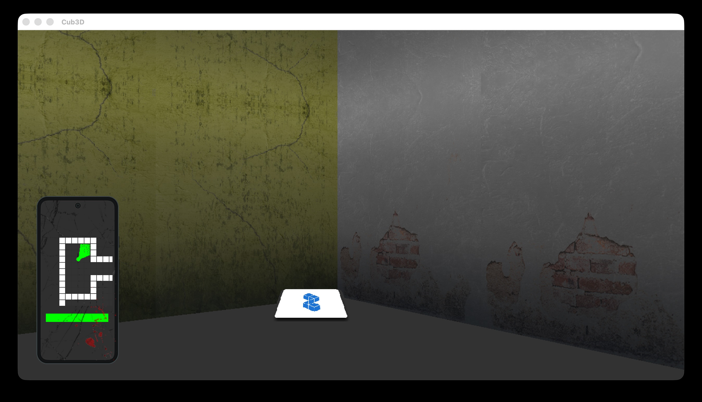
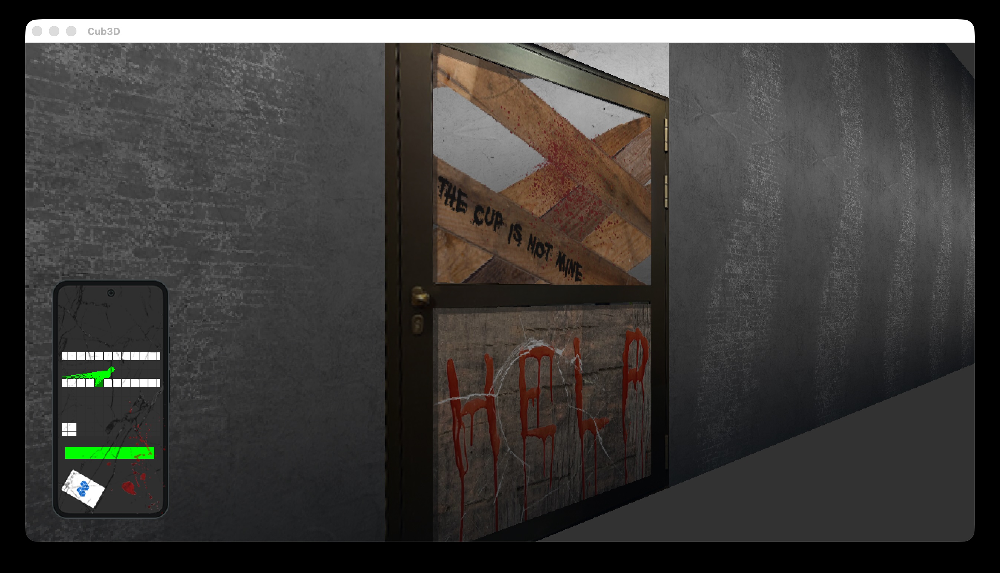
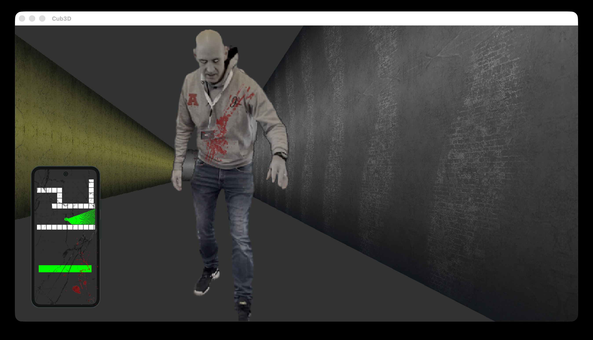

# Cub3D

Raycasting 3D FPS engine in C inspired by Wolfenstein 3D and Doom.

## Demo

## Inspiration

This project draws direct inspiration from the golden age of FPS gaming:

- **Wolfenstein 3D (1992)** — The first true FPS, developed by Id Software under John Carmack's technical leadership and John Romero's design vision. It introduced raycasting as a technique to create 3D-like environments from 2D map data.
- **Doom (1993)** — Romero's masterpiece that elevated the genre with sprites, ambient lighting, multiplayer, and the iconic "IDDQD" legacy.

Cub3D pays homage to these milestones while implementing the core raycasting algorithm from scratch.

## Description

Cub3D is a real-time raycasting first-person shooter (FPS) inspired by Wolfenstein 3D and Doom. This project transforms a 2D map file into an immersive 3D first-person experience where players navigate through maze-like environments, collect keys, avoid enemies, and interact with doors.

The game features a raycasting engine that renders pseudo-3D walls using the classic technique, sprite-based enemies and collectibles with depth-sorted rendering, interactive doors, a minimap for navigation, sound effects, and a dynamic HUD displaying health and collected keys.

## Technologies & Concepts

- Raycasting mathematics (DDA algorithm for wall distance calculation)
- 2D-to-3D projection for pseudo-3D rendering
- Sprite rendering with depth buffering (painter's algorithm)
- Event-driven graphics programming (MLX42 with GLFW)
- Texture mapping and color gradient shading
- Game loop design and delta-time movement
- Collision detection in grid-based maps
- File parsing for map configuration (.cub format)
- Sound integration with SDL2\_mixer
- Minimap generation and player tracking

## How It Works

1. **Map Parsing** — Reads the .cub file, validates texture paths, extracts floor/ceiling colors, and builds a 2D grid representation of the world. The player's starting position and direction are extracted from the map.

2. **Raycasting Engine** — For each vertical strip of the screen, casts a ray from the player's position into the map. The DDA algorithm steps through the grid to find the first wall hit, calculating perpendicular distance to avoid fisheye distortion.

3. **Wall Rendering** — Draws wall strips with height inversely proportional to distance. Colors are shaded based on whether the hit wall is facing N/S (darker) or E/W (lighter) for pseudo-lighting.

4. **Sprite System** — Enemies, keys, and other sprites are rendered using a projection system that scales sprites based on distance. Depth sorting ensures far sprites are drawn before close ones.

5. **Door Interaction** — Doors are special wall tiles that toggle between open and closed states with animation over several frames.

6. **Minimap** — A top-down view in the corner shows the player, walls, doors, keys, and enemies, updating in real-time.

7. **Game Loop** — Processes input, updates player position with collision detection, casts rays, renders the scene, draws sprites, updates the minimap, and renders the HUD.

## Key Features

- **Raycasting Engine** — Classic Wolfenstein 3D-style rendering with DDA algorithm
- **Sprite-Based Enemies** — Depth-sorted sprite rendering with billboarding
- **Collectible Keys** — Keys displayed in HUD, required to unlock doors
- **Interactive Doors** — Open/close with animation, can be locked behind keys
- **Minimap** — Real-time navigation with player position and entity markers
- **Sound Effects** — Footsteps, door sounds, key collection, enemy alerts via SDL2\_mixer
- **Multiple Maps** — Three test maps with increasing complexity
- **Dynamic HUD** — Health bar, key counter, game status
- **Cross-Platform** — macOS and Linux support via MLX42 and GLFW

## Visuals

## Controls

| Key   | Action                |
|-------|----------------------|
| W     | Move forward         |
| S     | Move backward        |
| A     | Strafe left          |
| D     | Strafe right         |
| ←     | Rotate left          |
| →     | Rotate right         |
| SPACE | Start game / Interact|
| ESC   | Exit / Menu          |

## Tech Stack

- **Language:** C
- **Graphics:** MLX42 — Modern graphics library with GLFW backend
- **Windowing:** GLFW — Cross-platform window and input library
- **Audio:** SDL2\_mixer — Sound effects
- **Libraries:** Libft for utility functions

## Team

- [Rufussed](https://github.com/Rufussed) — Co-developer

### Links
- [Git Repo](https://github.com/fabbbiodc/cub3d)
