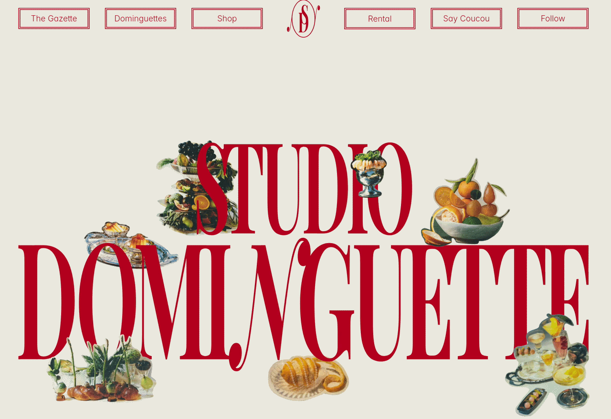
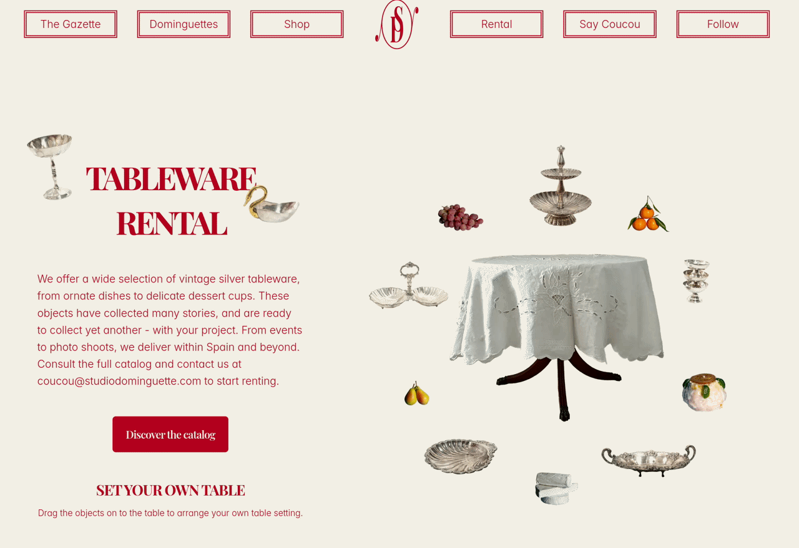
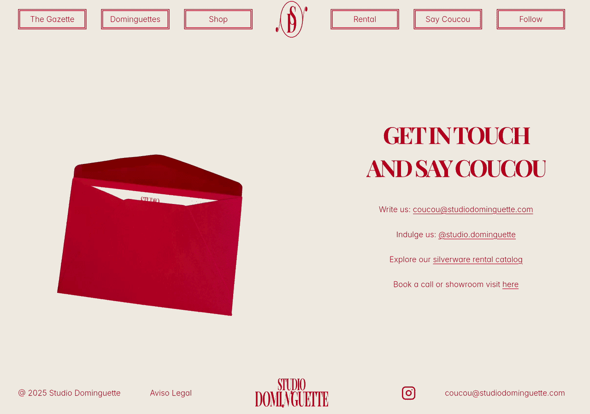
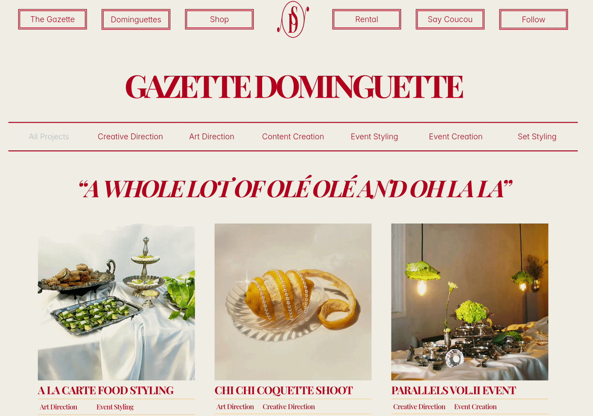

# Studio Dominguette

An immersive, interactive portfolio website built in Framer for a Barcelona-based creative studio.

## Demo

## Overview

Studio Dominguette crafts visual, culinary, and experiential stories through brand activations and immersive pop-ups, driven by a nostalgic, vintage jet-set aesthetic.

Working directly from the client's provided design, my role was to develop the site in Framer. The primary objective was to translate their tactile, highly detailed brand identity into a digital space through fluid motion, playful interactions, and a bespoke CMS architecture.

## Key Features

- **Animated Hero Section** — A kinetic entrance designed to instantly immerse visitors in the studio's unique visual narrative.
- **Interactive Tabletop** — A playful drag-and-drop physics section allowing users to move decorative elements around, mirroring the studio's physical set-styling work.
- **Editorial CMS** — A custom-styled Content Management System structured like a vintage newspaper to dynamically showcase their campaigns and events.

## Visuals

## Tech Stack

- **Platform:** Framer
- **Architecture:** Framer CMS
- **Design:** Provided by Client

### Links
- **Live Site:** [studiodominguette.com](https://www.studiodominguette.com/)