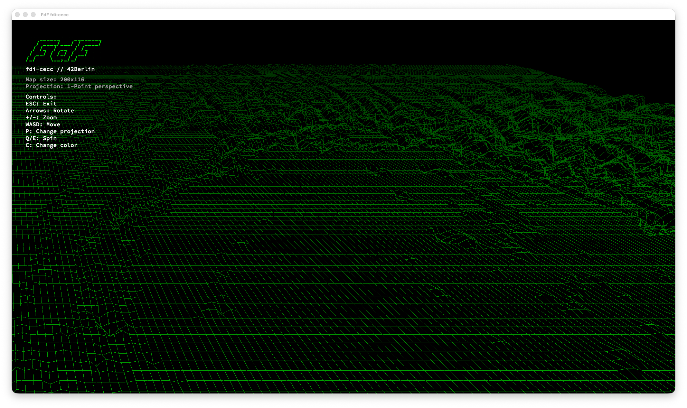
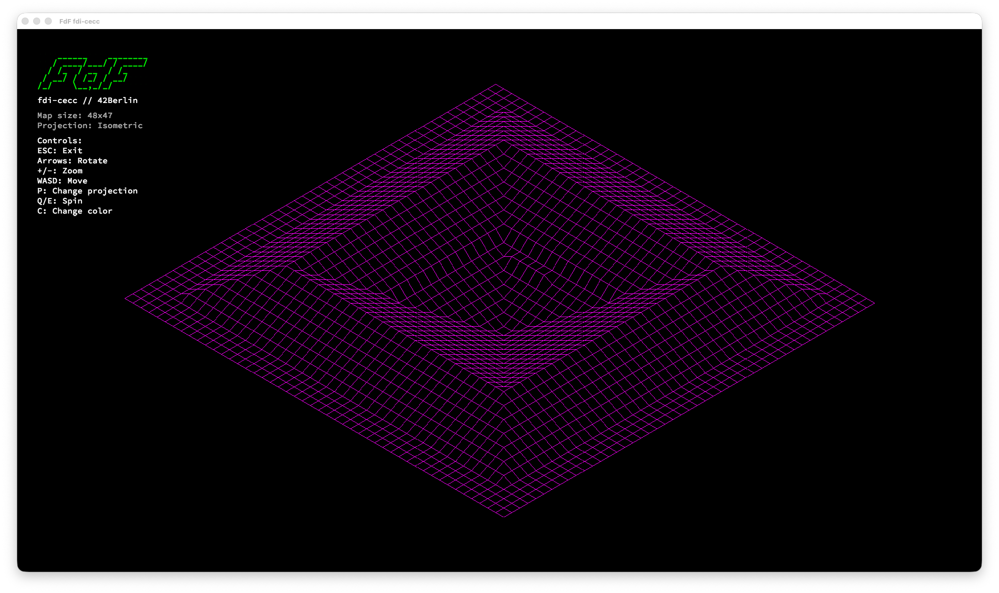
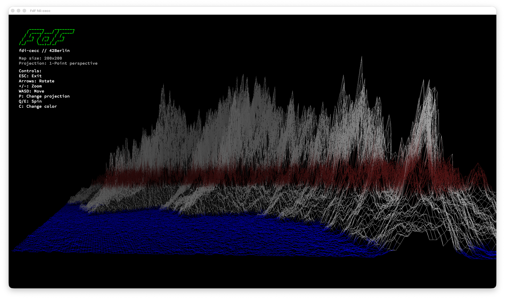
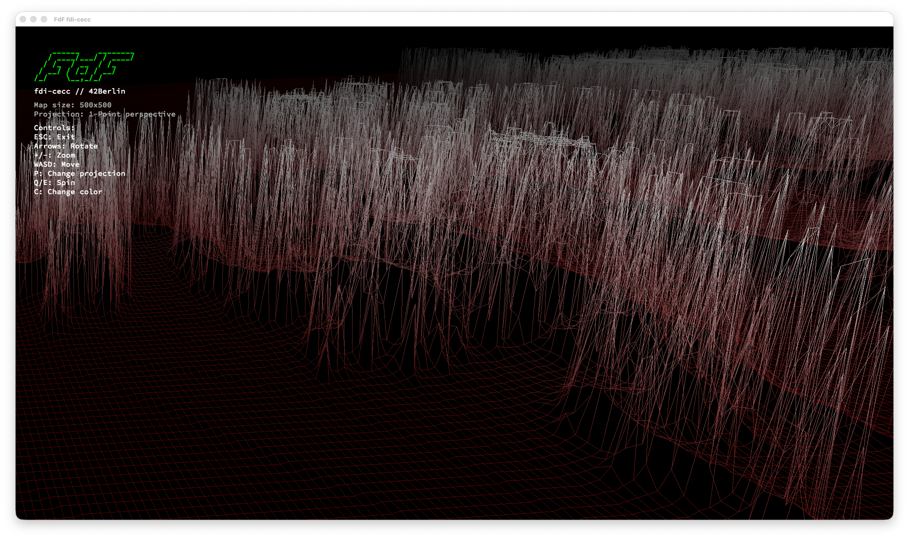

# Fdf

3D wireframe landscape renderer with 4 projection modes (isometric, orthographic, perspective), DDA line drawing, and performance optimization.

## Demo

## Description

Fdf (short for *fil de fer*, French for "wireframe model") is a 3D wireframe landscape renderer written in C. It reads terrain data from `.fdf` map files — grids of height values — and renders them as interactive 3D wireframe models using the MiniLibX graphics library.

The project supports multiple projection modes, real-time camera controls, color interpolation based on terrain depth, and performance optimizations including screen-space point caching and precomputed transforms for smooth interaction with large maps.

## Technologies & Concepts

- 3D-to-2D projection mathematics (isometric, orthographic, perspective)
- Matrix transformations for rotation and scaling
- DDA (Digital Differential Analyzer) line drawing algorithm
- Event-driven graphics programming with MiniLibX
- Image buffer manipulation and pixel-level rendering
- Color interpolation and depth-based shading
- File parsing for structured terrain data
- Memory management for 2D grid data structures
- Performance optimization through caching and precomputation

## How It Works

1. **Parsing** — Reads `.fdf` files where each number represents a point's altitude. Grid position determines X/Y coordinates, value determines Z (height). Optional hex colors can be embedded per point.
2. **Camera Setup** — Calculates map bounds and fits the view to the window, centering the terrain.
3. **Transformation** — Each point undergoes rotation (X, Y, Z axes), scaling, and centering using 3×3 rotation matrices computed once per frame.
4. **Projection** — Transformed 3D points are projected to 2D using the selected projection mode (isometric, orthographic, one-point, or two-point perspective).
5. **Screen-Space Caching** — Transformed points are stored in a 2D cache to avoid redundant transformations.
6. **Rendering** — Cached screen points are used to draw lines between adjacent points with color interpolation. An inlined DDA algorithm computes step values once per line.
7. **Panel Overlay** — A semi-transparent info panel displays map dimensions, current projection, color scheme, and control hints.

## Key Features

- **Four Projection Modes** — Isometric, orthographic, one-point and two-point perspective with real-time switching
- **Interactive Camera** — Full rotation (X/Y/Z), translation (pan), and zoom controls
- **DDA Line Drawing** — Smooth line rendering using the Digital Differential Analyzer algorithm
- **Color Interpolation** — Gradient colors between connected points with depth-based fading
- **Multiple Color Schemes** — Toggle between different terrain coloring modes
- **Perspective Distance Control** — Adjust projection distance for perspective distortion
- **Info Panel** — Real-time display of map info, projection mode, and controls
- **Multiple Map Files** — Ships with 20+ terrain maps including Mars topography, fractals, and geometric shapes
- **Cross-Platform** — Native support for macOS (OpenGL) and Linux (X11)
- **Performance Optimized** — Screen-space point cache, precomputed rotation matrix, inlined DDA. 10-20x faster on large maps.

## Visuals

## Controls

| Key       | Action                       |
|-----------|------------------------------|
| ESC       | Quit                         |
| + / -     | Zoom in / out                |
| ← / →     | Rotate around Y axis         |
| ↑ / ↓     | Rotate around X axis         |
| Q / E     | Spin (Z axis rotation)       |
| A / D     | Move left / right            |
| W / S     | Move up / down               |
| P         | Cycle projection mode        |
| C         | Toggle color scheme          |
| O / L     | Adjust perspective distance  |

### Projection Modes (press P to cycle)

1. **Isometric** — Default 30° isometric projection
2. **Orthographic** — Top-down view without perspective
3. **One-point perspective** — Single vanishing point
4. **Two-point perspective** — Dual vanishing points for dynamic view

## Performance

| Optimization                   | Before                        | After                        | Impact               |
|-------------------------------|-------------------------------|------------------------------|----------------------|
| Rotation matrix               | Computed per point            | Computed once per frame      | 5-10x faster         |
| Point transforms              | 2-4x per point                | Once, cached                 | 2-4x fewer           |
| Depth computation             | Separate full-map pass        | Computed inline              | Eliminates 1 pass    |
| DDA line drawing              | Deltas recalculated per pixel | Computed once, incremented   | ~2x faster lines     |

## Tech Stack

- **Language:** C
- **Graphics:** MiniLibX — OpenGL (macOS) / X11 (Linux) with automatic OS detection
- **Line Drawing:** DDA (Digital Differential Analyzer) algorithm
- **Libraries:** Custom Libft submodule for utility functions

### Links
- [Git Repo](https://github.com/fabbbiodc/fdf)
