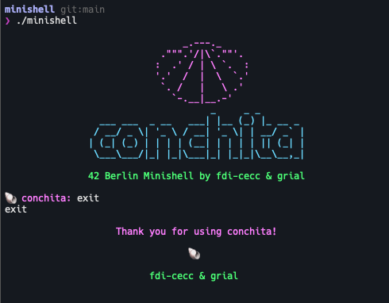

# Minishell

Bash-like Unix shell in C with pipes, redirections, signal handling, and command parsing.

## Demo

## Description

Minishell is a minimal Unix shell implementation written in C. It provides an interactive command-line interface that mimics core Bash behavior, including command execution, pipes, redirections, environment variable expansion, signal handling, and built-in commands.

This was a collaborative project with [gabrielrial](https://github.com/gabrielrial).

## Technologies & Concepts

- Process creation with `fork()`, `execve()`, and `waitpid()`
- File descriptor manipulation with `pipe()`, `dup()`, `dup2()`
- Signal handling with `sigaction()` for ctrl-C, ctrl-D, ctrl-\\
- Command-line parsing and tokenization (lexer)
- Quote handling (single and double quotes with `$` expansion)
- Environment variable expansion (`$VAR` and `$?`)
- Heredoc implementation with delimiter reading
- Readline integration for command history and line editing
- Memory management with valgrind leak detection

## How It Works

1. **Readline** — Displays a prompt and reads user input with line editing and history support via GNU Readline.
2. **Lexer** — Tokenizes the input line into a linked list, identifying words, operators (`|`, `<`, `>`, `<<`, `>>`), and quotes.
3. **Quote Handling** — Processes single quotes (no interpretation) and double quotes (allows `$` expansion), stripping quote characters from tokens.
4. **Expansion** — Replaces `$VAR` with environment variable values and `$?` with the last exit status.
5. **Parsing** — Builds a command structure from tokens, identifying pipes, redirections, and arguments.
6. **Heredoc Processing** — For `<<` redirections, reads input lines until the delimiter is found.
7. **Execution** — Forks child processes for each command in the pipeline, sets up pipes and redirections via `dup2()`, resolves executables using `PATH`, and calls `execve()`.
8. **Wait** — Parent waits for all children, collects exit statuses, and updates `$?`.

## Key Features

- **Interactive Prompt** — Readline-based with command history and line editing
- **Full Pipe Support** — Arbitrary-length command pipelines connected via `pipe()`
- **Four Redirection Types** — Input, output, append, and heredoc
- **Environment Variable Expansion** — `$VAR` and `$?` with proper quoting rules
- **Signal-Safe Design** — Single global variable for signal number, no data structure access in handlers
- **PATH Resolution** — Searches `PATH` for executables, supports absolute and relative paths
- **Built-in Commands** — All 7 required builtins with proper exit status tracking

## Built-in Commands

| Command            | Description                          |
|--------------------|--------------------------------------|
| `echo [-n]`        | Print arguments with optional -n     |
| `cd [path]`        | Change working directory             |
| `pwd`              | Print working directory              |
| `export [KEY=VALUE]` | Set or display environment variables |
| `unset [KEY]`      | Remove environment variables         |
| `env`              | Display current environment          |
| `exit [status]`    | Exit the shell                       |

## Redirections

| Operator | Description               | Example                  |
|----------|---------------------------|--------------------------|
| `<`      | Input redirection         | `cat < file.txt`         |
| `>`      | Output (overwrite)        | `ls > output.txt`        |
| `>>`     | Output (append)           | `echo "log" >> log.txt`  |
| `<<`     | Heredoc                   | `cat << EOF`             |

## Bonus Features

- **`&&` and `||` Operators** — Logical AND/OR with parentheses for priority grouping
- **Wildcards (`*`)** — Glob pattern matching for files in the current working directory

## Tech Stack

- **Language:** C
- **Process Management:** `fork()`, `execve()`, `waitpid()`, `pipe()`, `dup2()`
- **Signal Handling:** `sigaction()`, `sigemptyset()`, `sigaddset()`
- **Line Editing:** GNU Readline
- **Libraries:** Custom Libft submodule

## Team

- [gabrielrial](https://github.com/gabrielrial) — Co-developer

### Links
- [Git Repo](https://github.com/fabbbiodc/minishell)
