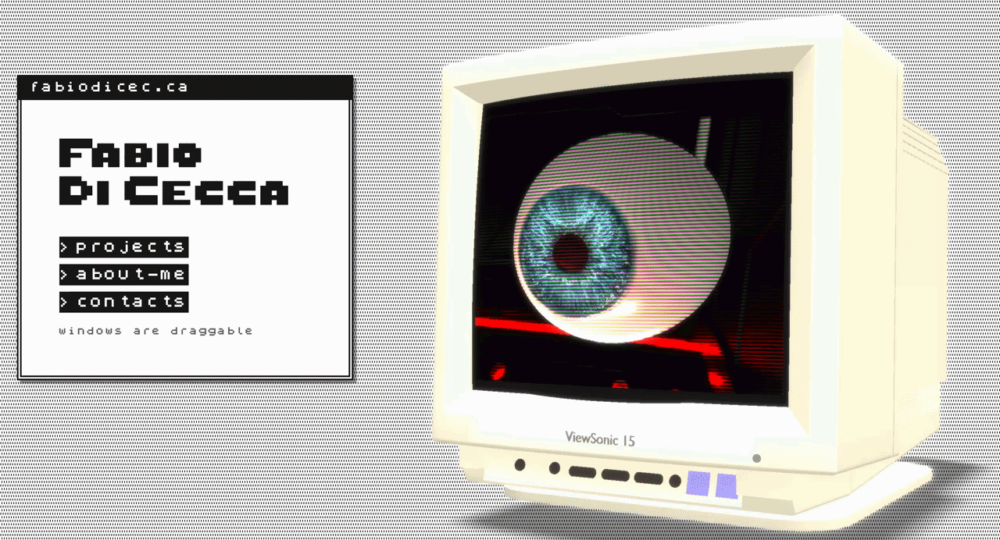
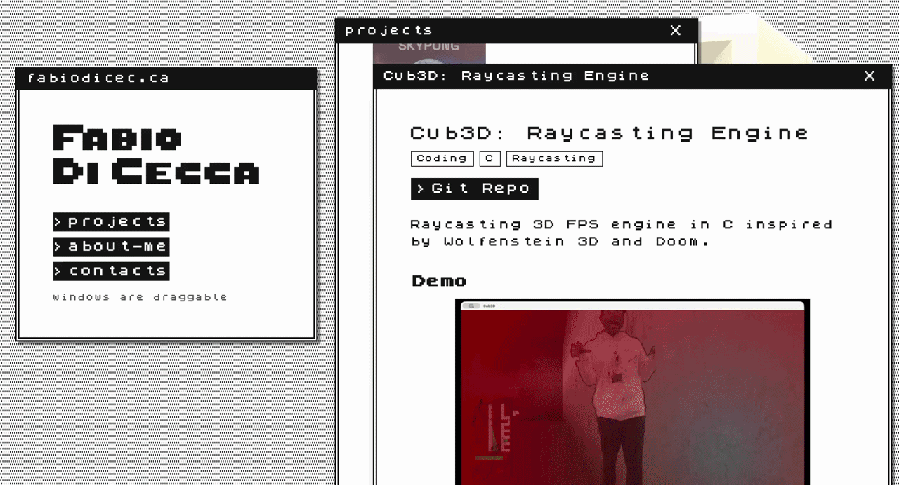

# Portfolio — fabiodicec.ca

A retro‑futuristic single‑page portfolio built with Astro, Three.js, and Tailwind CSS v4. Features a real‑time 3D background, draggable OS‑style windows, and a ZX Spectrum‑inspired aesthetic.

## Demo

## Overview

This portfolio is a self‑contained project about itself — a digital space that showcases work while embodying a nostalgic computing experience. The interface mimics a retro operating system with draggable windows, pixel‑art cursors, and a monochrome palette accented by neon green.

At its core is a real‑time 3D scene rendered with Three.js: a mouse‑tracked anatomical eye and a CRT monitor, lit by an HDR environment and processed through postprocessing effects (bloom, pixelation, scanlines, glitch). Content is delivered via markdown files rendered into windows, with a typewriter effect for the hero text.

## Key Features

- **3D Scene** — Mouse‑tracked eye model and CRT monitor in an HDR‑lit environment with SelectiveBloom, Pixelation, Scanline, and Glitch effects.
- **Draggable Windows** — Custom implementation with cascading layout, z‑index stacking, and localStorage persistence.
- **Typewriter Effect** — Configurable TextType component wired through DOM data attributes.
- **Pixel‑Art Cursors** — Custom cursors (default, pointer, grab, grabbing) at 2x resolution via CSS `image-set()`.
- **Loading Flow** — Assets load → progress bar → start button → iOS device orientation permission → animation starts.
- **Markdown Content** — About, CV, impressum, and credits loaded from `/public/*.md` files.
- **Retro Scrollbars** — Custom styled scrollbars matching the OS aesthetic.

## Visuals

## Tech Stack

- **Framework:** Astro 6.x
- **Styling:** Tailwind CSS v4 (CSS‑based `@theme`, no config file)
- **3D Rendering:** Three.js
- **Postprocessing:** postprocessing (SelectiveBloom, Pixelation, Scanline, Glitch)
- **Language:** TypeScript (strict)
- **Font:** ZxSpectrum (Freeware)
- **Tooling:** Prettier with `prettier-plugin-astro`

### Links

- **Source:** [github.com/fabbbiodc/portfolio](https://github.com/fabbbiodc/portfolio)
