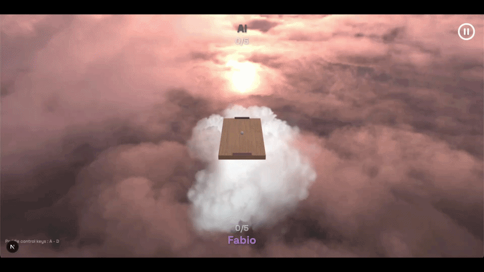

# SkyPong


Full-stack real-time multiplayer Pong game built with Next.js, NestJS, WebSockets, and Babylon.js.

## Demo




## Description

SkyPong is a production-style multiplayer Pong platform built as a microservices architecture. The core is a real-time 3D Pong game with server-authoritative physics, PBR rendering, and multiple game modes. Around it sits a full product platform with authentication, profiles, social features, and game statistics.

This is a reupload with a fresh frontend UI of a project originally built by a team of 4 developers. The new version features a complete redesign of the Next.js web application with a unified design system while keeping the robust game engine and backend services intact.

## Technologies & Concepts

- **Web application** — Next.js (React), TypeScript, Tailwind v4, class-variance-authority, i18n (EN/ES/IT)
- **Game client** — Babylon.js 8, React 18, Vite 5, Colyseus.js client
- **Game server** — Colyseus 0.15, Babylon.js NullEngine (headless physics), Express
- **Backend services** — Fastify, SQLite, JWT (Argon2), Sharp (avatar processing)
- **Infrastructure** — Docker Compose, NGINX (TLS gateway), Prometheus, Grafana, Alertmanager
- **Real-time sync** — WebSocket via Colyseus, Schema-based state diffs, client-side interpolation
- **Physics** — Server-authoritative, continuous collision detection, angle-based bounce response
- **Rendering** — PBR materials, EXR environment maps, refractive glass, real-time shadows
- **Design system** — Unified design tokens, full CVA component library, responsive mobile layout

## Frontend Redesign

A complete redesign of the Next.js web application targeting consistency, maintainability, and scalable UI:

- **Design tokens** — Single source of truth with TypeScript types for colors, typography, spacing, shadows
- **Component library** — Full class-variance-authority patterns (Button, Card, TextField, Chip, Avatar, Badge, StatCard, Tabs)
- **Pattern components** — Section, ListRow, EmptyState, LoadingState, PageContainer, FormCard, ProfileLayout
- **Simplified CSS** — Reduced globals.css from 1300 to ~250 lines
- **Background & shadow tokens** — Unified system replacing hardcoded values
- **Navbar** — Auth-aware navigation with scroll behavior, dropdown menu
- **Homepage** — Hero section, Footer, LanguageSelector, interactive PBR marble ball CTA
- **Game scene background** — Babylon.js rotating EXR skybox integrated into Next.js layout
- **i18n** — 477 translation keys verified across English, Spanish, and Italian
- **TypeScript** — Strict typing on auth context, translation context, form validation
- **Color system** — Updated from purple to slate palette for better contrast

## How It Works

### Architecture Overview

```
   Client (Browser)             Gateway (NGINX)              Services (Docker)
 ┌──────────────────┐          ┌──────────────────┐          ┌──────────────────┐
 │ Next.js app      │──HTTPS──►│ TLS termination  │          │ auth-service     │
 │ (port 3000)      │          │ Route mapping    │◄─REST───►│ profile-service  │
 │                  │          │ WebSocket proxy  │          │ stats-service    │
 ├──────────────────┤          └──────────────────┘          ├──────────────────┤
 │ Game client      │───WS────►│                  │◄──WS────►│ game-service     │
 │ (Vite 5, 5173)   │          │                  │          │ (Colyseus)       │
 └──────────────────┘          └──────────────────┘          └──────────────────┘
                                         │
                               ┌─────────┴────────┐
                               │ Observability    │
                               │  Prometheus      │
                               │  Grafana         │
                               └──────────────────┘
```

### Game State Flow

1. Player sends input (keyboard/touch) via WebSocket message
2. Server aggregates input, runs physics at 60 Hz (Babylon.js NullEngine)
3. Server detects collisions (CCD), updates scores, broadcasts state diffs
4. Client receives diffs, interpolates ball position toward extrapolated target
5. Client renders at browser refresh rate (60-144 Hz)

## Key Features

- **Game modes** — AI (3 difficulties), local 2-player, online PvP with room matchmaking
- **PBR rendering** — Environment-based lighting, refractive glass paddles, marble materials, EXR skybox
- **Server-authoritative** — Physics runs server-side (NullEngine), preventing cheating
- **Real-time multiplayer** — WebSocket via Colyseus with 60 Hz server tick
- **Client interpolation** — Exponential smoothing, wall reflection extrapolation, adaptive distance
- **Design system** — TypeScript tokens, CVA components, unified shadows and backgrounds
- **i18n** — Full UI in English, Spanish, and Italian with type-safe translation context
- **Authentication** — JWT with access/refresh tokens, optional 2FA
- **Social** — Friendship graph (send/accept/reject/block), global chat
- **Statistics** — Game result ingestion, leaderboard aggregation
- **Monitoring** — Prometheus metrics, Grafana dashboards, Alertmanager alerts
- **Responsive** — Mobile touch controls, adaptive HUD sizing

## Project Structure

```
skypong/
├── front/                      # Next.js web application (redesigned)
│   └── app/
│       ├── lib/design-tokens.ts
│       ├── ui/base/             # CVA component library
│       ├── ui/patterns/         # Reusable page patterns
│       ├── ui/GameSceneBackground.tsx
│       └── ui/base/InteractiveMarbleBall.tsx
│
├── game/                      # SkyPong game engine
│   ├── client/src_cli/
│   │   ├── game/GameLoop.ts
│   │   ├── ui/GameHUD.ts
│   │   └── entities/
│   ├── server/src_serv/
│   │   ├── physics/PhysicsEngine.ts
│   │   ├── rooms/
│   │   └── entities/
│   └── common/
│
├── auth-service/
├── profile-service/
├── statistics-service/
├── nginx-gateway/
├── prometheus/
├── grafana/
└── docker-compose.yml
```

## Collaborators

- [Gugor](https://github.com/Gugor)
- [ilropd](https://github.com/ilropd)
- [MartiMarsa](https://github.com/MartiMarsa)

### Links
- [Source Code](https://github.com/fabbbiodc/skypong)
- [Play Now](http://fabbbiodc.github.io/skypong)
