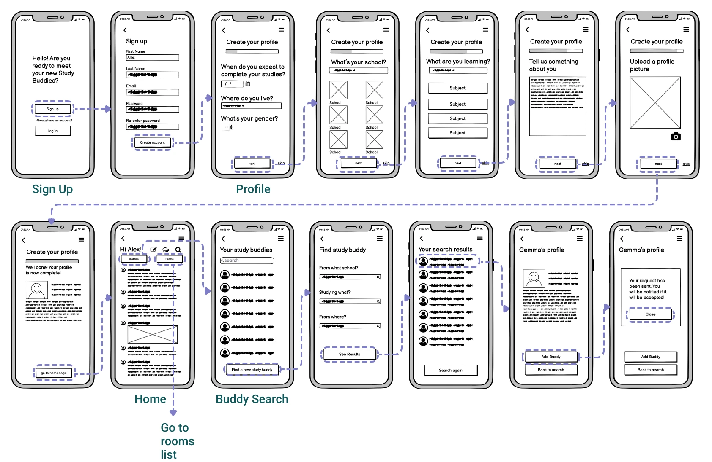
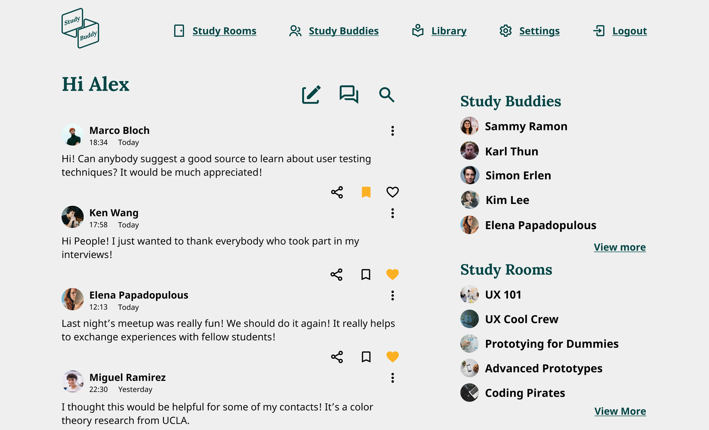
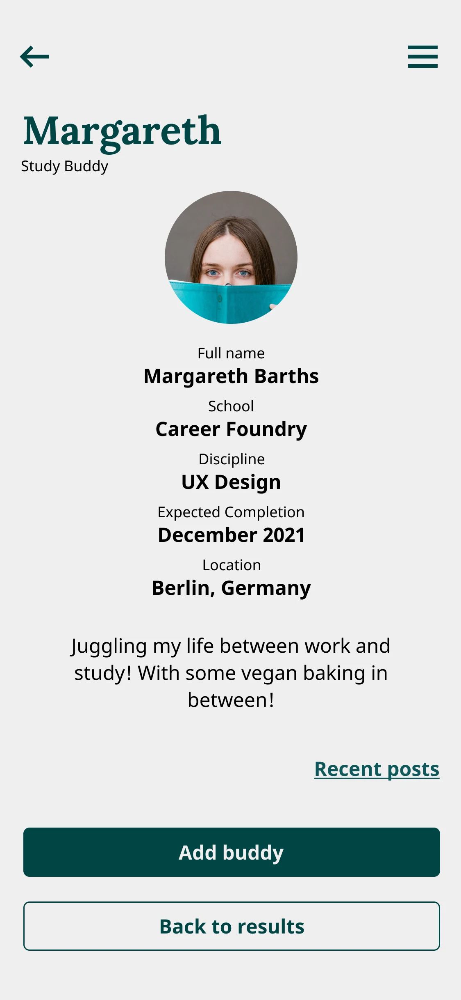

# Study Buddy - Student collaboration

## Overview
Study Buddy is a web-based application designed to enhance academic collaboration among students. Developed during my UI specialization at CareerFoundry, this project involved an end-to-end design process tailored to create a friendly, warm, and reassuring platform for students to connect, share knowledge, and collaborate on their academic journey.

Go to the video presentation at the bottom!

## Key Features
* **Student Matching:** Connect with students studying the same or related subjects.
* **Knowledge Sharing:** Share articles, videos, images, and other resources.
* **Community Posts:** Write and read posts for peer-to-peer learning.
* **Profile Creation:** Build a profile to find like-minded collaborators.

## Case Study Preview

## Next Steps
Further usability testing and iteration based on user feedback, with potential expansion of collaboration features.

## Additional Details

### The project
The "Study Buddy" project, developed during my UI specialization at CareerFoundry, involved an end-to-end design process tailored to enhance academic collaboration among students. This initiative started with a thorough analysis of user needs through research, followed by the crafting of user flows and information architecture. I ideated and prototyped essential features to ensure optimal usability and engagement. The design phase culminated with high-fidelity mockups, preparing the web app for seamless functionality and an intuitive user experience.

### User flows
The user flows for 'Study Buddy' were designed to cater to users like Alex, a part-time retail store manager enrolled in an online course. Alex seeks to collaborate with like-minded students to complete his course quickly and gain marketable skills. The flows include steps for creating a profile, connecting with students studying the same or related subjects, and facilitating collaboration and support. Additionally, frequent users like Alex can view and share articles, videos, images, and other files, as well as write posts for other students to read, promoting knowledge sharing.

### Wireframes
After establishing the initial user flows, the project transitioned into the wireframing phase. Here, the focus was on translating the conceptual diagrams into tangible designs that reflected the intended user interactions and functionalities. Low-fidelity wireframes provided a basic skeletal structure, outlining the layout and placement of key elements. Subsequently, mid-fidelity wireframes added more detail, incorporating specific interface components and interactions. This iterative process ensured that the design evolved cohesively, aligning with the project's goals and user requirements.

**Low fidelity:** Basic skeletal structure of the interface.

**Mid fidelity:** More detailed wireframes with specific interface components.

### Moodboard
As outlined in the project's briefing, the aim is to evoke a sense of friendliness, warmth, and reassurance, with a specific emphasis on using the color green. This directive guided the development of the moodboard, which sought to create an atmosphere of calming reassurance infused with an academic undertone. The curated collection of images, colors, and textures aims to strike a balance between approachability and professionalism, ensuring that users feel welcomed and encouraged in their academic endeavors.

### Design guide
Full Design Guide Pdf

### Animations
Interactive animations to enhance the user experience.

### Final mockups
High-fidelity mockups of the final product ready for development.

### Prototype
Sign up and explore the app in the prototype by clicking on the button below.

### Video presentation
Back to the top

### Learnings
In this project, I ventured into the realm of UI design, marking a pivotal moment in my journey toward mastering the intricacies of user interface design. "Study Buddy" provided a hands-on opportunity to delve into the principles of UI design, from crafting visually appealing layouts to selecting cohesive color palettes and typography. Through this experience, I acquired a deeper understanding of the nuances of UI design, honing my skills in creating interfaces that are both aesthetically pleasing and intuitively navigable. This project served as a valuable stepping stone in my ongoing quest to excel in the field of UI design.

### Team & Contributors
Solo UI design project as part of CareerFoundry UI specialization.
