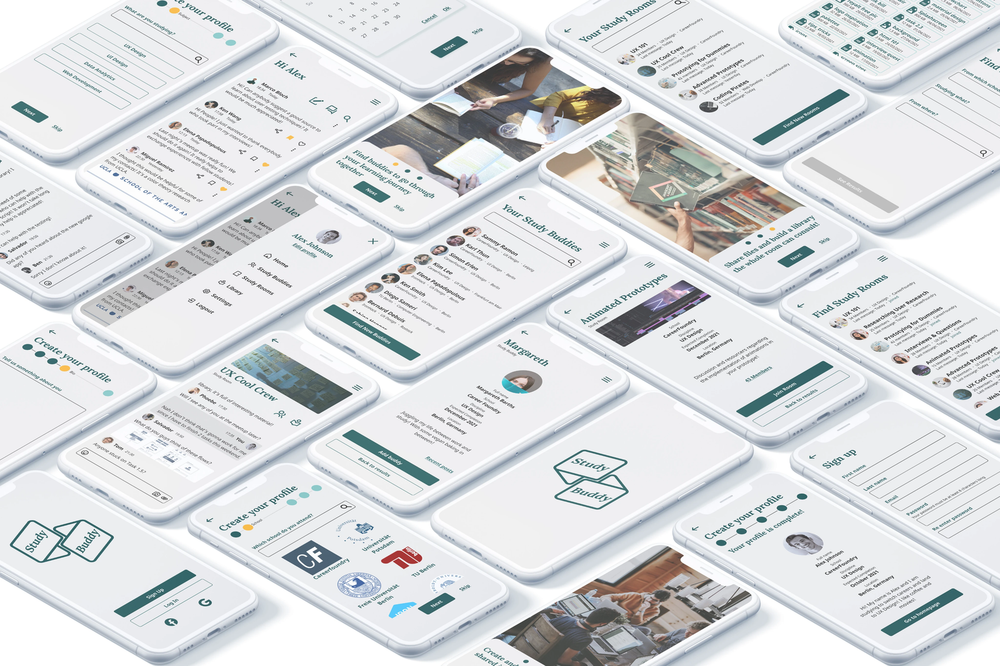

# Study Buddy - Student collaboration

Study Buddy is a web-based application designed to **enhance academic collaboration among students**. Created as part of the UI for UX Designers specialization course at CareerFoundry, this app facilitates connections between students by utilizing criteria like school, discipline, and location. Users can engage in one-on-one meetings or join thematic rooms where they can share digital files and participate in discussions, all aimed at supporting each other's academic and professional learning goals.

[Go to the video presentation at the bottom!](./tresor#video)

## Case Study Preview

## The project

The "Study Buddy" project, developed during my UI specialization at CareerFoundry, involved an end-to-end design process tailored to enhance academic collaboration among students. This initiative started with a thorough analysis of user needs through research, followed by the crafting of user flows and information architecture. I ideated and prototyped essential features to ensure optimal usability and engagement. The design phase culminated with high-fidelity mockups, preparing the web app for seamless functionality and an intuitive user experience.

### User flows

The user flows for 'Study Buddy' were designed to cater to users like Alex, a part-time retail store manager enrolled in an online course. Alex seeks to collaborate with like-minded students to complete his course quickly and gain marketable skills. The flows include steps for creating a profile, connecting with students studying the same or related subjects, and facilitating collaboration and support. Additionally, frequent users like Alex can view and share articles, videos, images, and other files, as well as write posts for other students to read, promoting knowledge sharing.

### Wireframes

After establishing the initial user flows, the project transitioned into the wireframing phase. Here, the focus was on translating the conceptual diagrams into tangible designs that reflected the intended user interactions and functionalities. Low-fidelity wireframes provided a basic skeletal structure, outlining the layout and placement of key elements. Subsequently, mid-fidelity wireframes added more detail, incorporating specific interface components and interactions. This iterative process ensured that the design evolved cohesively, aligning with the project's goals and user requirements.

#### Low fidelity

#### Mid fidelity

### Moodboard

As outlined in the project's briefing, the aim is to evoke a sense of friendliness, warmth, and reassurance, with a specific emphasis on using the color green. This directive guided the development of the moodboard, which sought to create an atmosphere of calming reassurance infused with an academic undertone. The curated collection of images, colors, and textures aims to strike a balance between approachability and professionalism, ensuring that users feel welcomed and encouraged in their academic endeavors.

### Design guide

Building upon the moodboard's direction, the design guide was developed to define key elements such as fonts, colors, icons, and a logo. These choices were carefully curated to convey the desired message and evoke the feelings established by the moodboard. The design guide serves as a comprehensive resource to ensure consistency and coherence across all aspects of the user interface. For a detailed view of the design guide, please refer to the full document [here](https://www.dropbox.com/s/xoqykvuu2kylu55/210405_2_3_style_guide.pdf?dl=0).

### [Full Design Guide Pdf](https://drive.google.com/file/d/1KFc6zRqBfxVLteVm-zmu0K3sV_w3zWAY/view?usp=sharing)

### Animations

### Final mockups

#### Prototype

Sign up and explore the app in the prototype by clicking on the button below.

#### Video presentation

[Back to the top](./tresor#tresor)

## Learnings

In this project, I ventured into the realm of UI design, marking a pivotal moment in my journey toward mastering the intricacies of user interface design. "Study Buddy" provided a hands-on opportunity to delve into the principles of UI design, from crafting visually appealing layouts to selecting cohesive color palettes and typography. Through this experience, I acquired a deeper understanding of the nuances of UI design, honing my skills in creating interfaces that are both aesthetically pleasing and intuitively navigable. This project served as a valuable stepping stone in my ongoing quest to excel in the field of UI design.

Thank you for reading all the way to the end! If you want to know more or you would like to chat click on the button to the right and get in touch.
