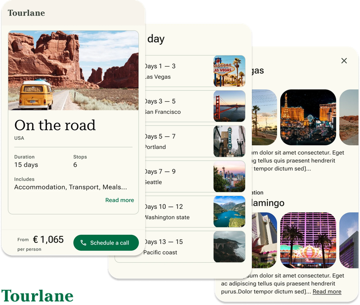
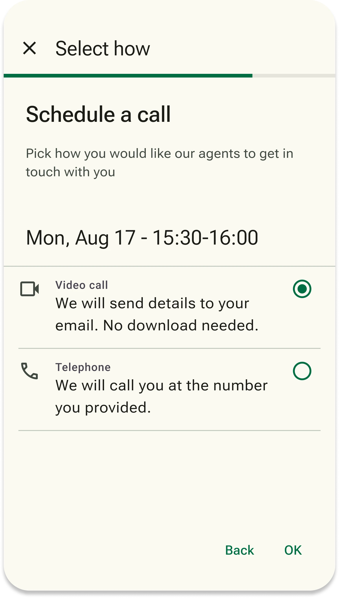
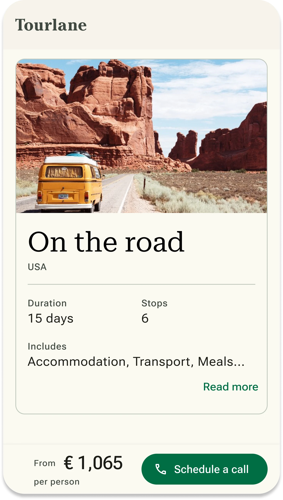

# Tourlane: Self Scheduling

## Overview
In my role as **Senior Product Designer**, I promoted the implementation of the Self Scheduling process. This initiative empowers users to **initiate contact with the company on their own terms**, **user satisfaction**, align with company objectives for **future scalability**, and **reduce costs** by minimizing the time spent by Travel Experts on cold calls to customers.

## Case Study Preview

## Additional Details

### What is Self Scheduling?
In the previous user journey at Tourlane, users input their travel preferences through the "enquiry experience," then moved to the "Offer Preview" page where they had to sign up to view a draft travel offer. After signing up, users unexpectedly received phone calls to qualify their intent and availability, often resulting in a disruptive experience.

The introduction of the Self Scheduling feature revolutionized this process. Integrated into the Offer Preview page, it allowed users to **schedule their own phone or video calls at their convenience**, **increase conversion rates** by ensuring that interactions were initiated by genuinely interested users, making the process more efficient and **user-friendly**.

### Why Self Scheduling?
**User Understanding:** Self-scheduling allows for direct insights into user preferences and behaviors by monitoring when and how users choose to engage. This data is crucial for tailoring services to better meet user needs.

**User Satisfaction:** By empowering users to control when they engage with travel consultants, self-scheduling significantly enhances user satisfaction. This control makes users feel respected and accommodated, contributing to a more positive user experience.

**Cost Saving:** Implementing self-scheduling reduces the need for unsolicited outreach, optimizing resources by saving time and expenses associated with cold calling. This leads to more efficient use of company resources.

**Company Goals:** Self-scheduling aligns with company objectives to provide personalized service and supports scalability and growth. By enabling a smoother, user-driven interaction model, the feature helps the company adapt to increasing user numbers without compromising service quality.

### Prototype
Click on the button to see the Self Scheduling and Offer Preview in action.
- Choose the trip "On the Road"
- Explore the offer preview page
- Click on one of the CTAs
- Complete the Self Scheduling process
- Go back to Offer

### My role in the process
As a Senior Product Designer at Tourlane, I led the enhancement of user experiences, specifically addressing user dissatisfaction with unsolicited calls. Together with the Product Manager, we developed the self-scheduling feature, overseeing the design process from low-fidelity sketches to high-fidelity prototypes.

### Collaboration
The development was driven by extensive user research and interviews, providing crucial insights that shaped the feature. Collaboration was key:

**With the Product Manager:** We worked closely from the beginning, identifying user pain points and refining the feature through continuous feedback, testing, and research.

**With the Engineers:** Our partnership ensured that the designs were technically feasible and effectively implemented, allowing for continuous adjustments to optimize performance.

**Stakeholder Management:** Regular updates and clear demonstrations of the project's impact were vital in securing ongoing support and resources from stakeholders.

### Conclusion
The introduction of the self-scheduling feature was a collaborative effort that combined user-centered design with effective team dynamics and stakeholder engagement, reflecting a commitment to improving user experience and operational efficiency at Tourlane.

### Further steps
**Old Offer Preview / New Offer Preview**

**Central Role in User Journey:** The Offer Preview page is crucial for users to review and consider travel options, acting as a key touchpoint in their decision-making process.

**Mobile Traffic Insight:** Recognizing that the majority of our users access the site via mobile devices guided our approach to redesign for optimal mobile engagement.

**Material Design 3 Implementation:** We adopted Material Design 3 guidelines to enhance the visual and functional aspects of the OP page, focusing on improved usability and aesthetics for a better mobile experience.

### Building user trust
**Importance of trust in travel:** In the travel industry, trust is essential as users make significant emotional and financial commitments based on the information provided. Establishing trust ensures users feel confident in their decisions.

**Trust building elements:** The Offer Preview page incorporates unique selling points (USPs) and clear explanations of the booking process. These elements are strategically placed to inform and reassure users about the value and reliability of the service.

**Information Architecture:** The layout and flow of information are designed to be intuitive and transparent, helping users easily understand how services work and what benefits they offer, which reinforces trust.

**Iterative Design Process:** We utilized an iterative design process to refine these trust-building elements, testing different approaches to determine the most effective way to communicate reliability and secure user confidence.

### Data driven decision making
**Foundation in research and analysis:** Every design decision at Tourlane is underpinned by thorough research and analysis, ensuring that our strategies are informed by data rather than assumptions.

**Utilization of analytical methods:** We employed a variety of methods to gather insights, including A/B testing to compare different design versions, heatmaps to visualize user engagement on our pages, and user testing to directly observe user interactions and gather feedback.

**Impact on product development:** The insights gained from these research methods were instrumental in developing the self-scheduling feature. Data showed a clear preference for user autonomy and control, leading to the implementation of a feature that allows users to schedule their interactions at their convenience.

### Achievements and future opportunities
**User empowerment:** Users gain significant control over their interactions, choosing the most convenient times to discuss their travel plans. This empowerment improves their overall experience and satisfaction, fostering a more user-centric approach.

**Improved qualification process:** Tourlane can better gauge the seriousness and readiness of potential customers through their proactive engagement. Scheduling a call serves as a strong indicator of a user's commitment to their travel plans, allowing for more effective and targeted marketing efforts.

**Operational optimization:** The self-scheduling feature enhances the efficiency of the sales team by focusing their efforts on users who demonstrate clear interest. This not only improves conversion rates but also reduces the wastage of resources on less interested prospects, streamlining operations and boosting productivity.

**Setting the stage for future innovations:** The success of the self-scheduling feature sets a precedent for further innovation at Tourlane. It opens avenues for additional user-driven features and services.

### Team & Contributors
Senior Product Designer at Tourlane, collaborating with Product Manager, Engineering team, and Stakeholders.
