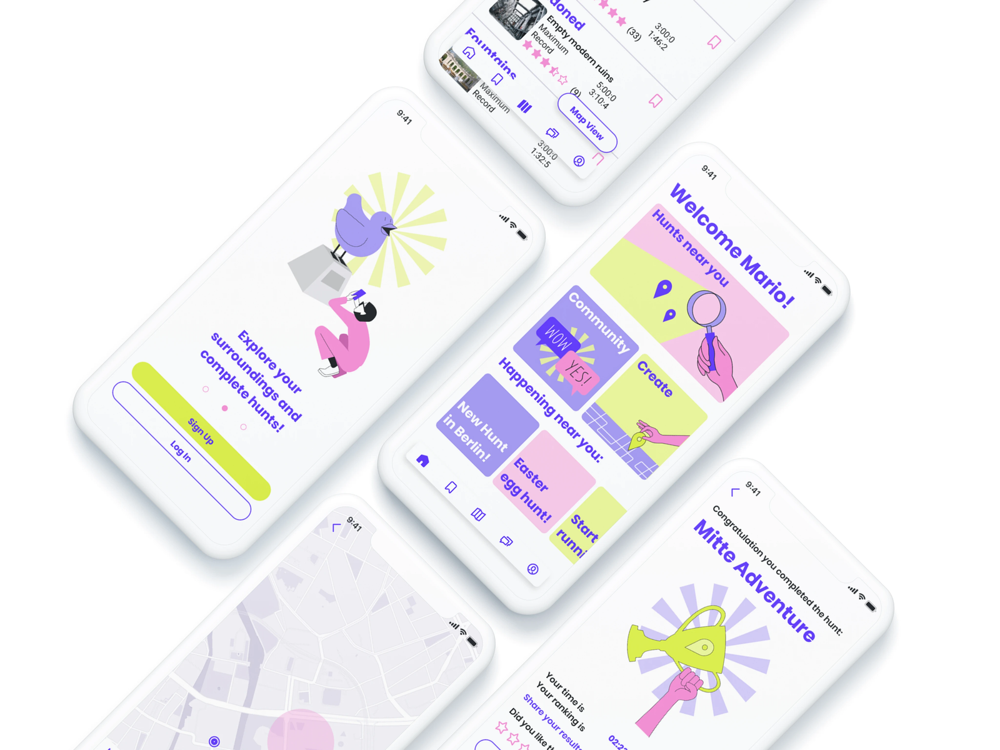
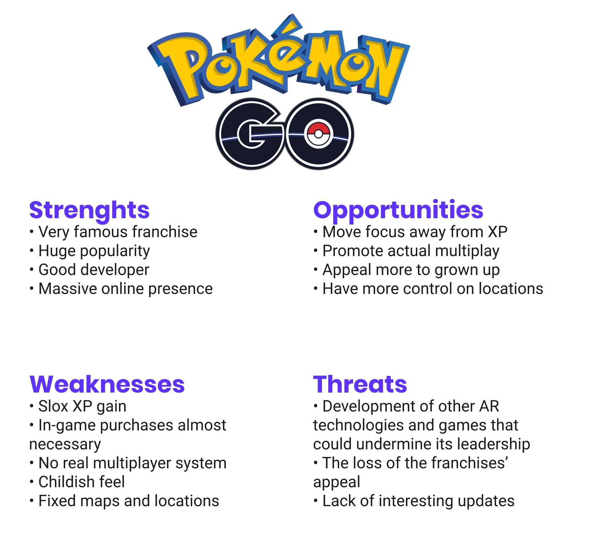
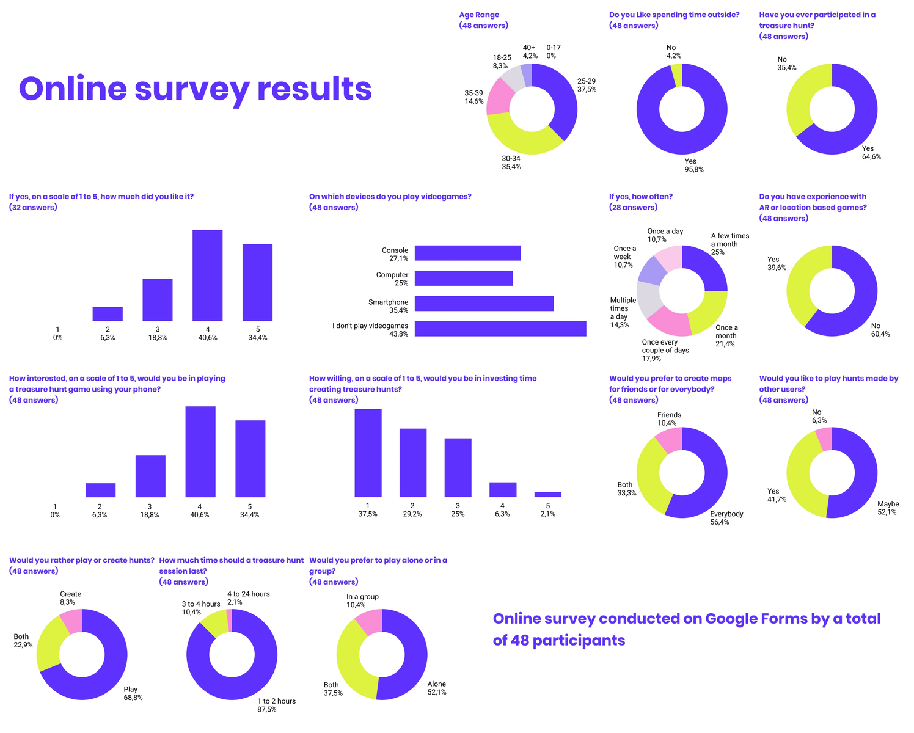

# Tresor - Treasure Hunt

## Overview
Tresor is an innovative app crafted to empower players to engage in or create their own treasure hunts, leveraging cutting-edge location-based and augmented reality technologies. These technologies are now widely available on most portable connected devices, making the treasure hunt experience both accessible and immersive. This project, part of my CareerFoundry UX design course, showcases how digital tools can transform traditional gaming into interactive, real-world adventures.

Go to the video presentation at the bottom!

## Key Features
* **AR Treasure Hunts:** Create and play location-based treasure hunts using augmented reality.
* **No Level Progression:** Accessible to all players regardless of experience level.
* **Community-Driven:** Users can both create and participate in hunts.
* **Real-World Interaction:** Combines digital gaming with physical exploration.

## Case Study Preview

## Next Steps
Further refinement of the AR experience and exploration of additional game mechanics based on user feedback.

## Additional Details

### The project
In the CareerFoundry bootcamp, I was presented with several project options and chose to design a game. The problem identified was the lack of engaging, accessible location-based games that don't rely on user levels for progression. My solution was "Tresor," a game I designed from scratch, which uses augmented reality and geolocation technology to create a dynamic treasure hunting experience. This approach ensures that all players, regardless of experience, can enjoy creating and participating in treasure hunts, promoting equal and active participation in a fun, immersive game environment.

### The process

#### Discover
In the "Discover" phase for the Tresor app, I focused on identifying market gaps and user needs through competitive analysis and direct user research. This foundational stage was crucial for setting the strategic direction of the design and understanding what features would significantly enhance the user experience.

**Competitive analysis:** Evaluated major games like Pokémon GO and Geocaching, using SWOT analysis to pinpoint opportunities for differentiation and innovation.

**Survey and interviews:** Collected extensive data on user preferences for outdoor activities, gaming experiences, and interactions with AR and GPS technology. This research was pivotal in formulating user personas, which guided the design strategy by providing a clear picture of the target users' characteristics and needs.

**Protopersonas and user journeys:** In the "Discover" phase of the Tresor app design, I formulated user personas and user journeys based on the quantitative and qualitative data gathered from surveys and interviews. This detailed data analysis ensured that the personas and journeys accurately reflected the diverse needs and behaviors of potential users, guiding targeted and effective design decisions throughout the development process.

#### Define
In the "Define" phase of the Tresor app design, the focus shifted to refining the structure and navigation based on insights from the "Discover" phase. This stage involved developing user flows, creating an initial information architecture, and employing card sorting to ensure the app's organization resonated well with potential users. Each step was crucial for establishing a solid framework for the interactive features of the app.

**User flows:** In the "Define" phase of the Tresor app, the development of user flows was a crucial step. These flows were carefully crafted using insights from the initial research and user personas, providing a visual representation of the steps users like Kevin would take when engaging in a treasure hunt within the app. This detailed planning helped to ensure that the user experience would be seamless and intuitive, guiding the design decisions for the app's functionality and navigation.

**Information architecture:** The information architecture was initially drafted into a sitemap and optimized through a round of card sorting. This process helped refine the organization of the app's content, making navigation more intuitive for users by ensuring logical access to various features and screens.

#### Ideate
Following the completion of extensive research, it was time to translate these insights into concrete designs for Tresor. This phase involved sketching several wireframes that detailed the navigation of the app and defined the functionalities for searching and creating hunts. These preliminary designs set the stage for refining how users would interact with the core features of Tresor, as illustrated by the examples of these functions in their early stages.

**Low fidelity wireframes:** Sketches detailed the navigation and defined functionalities for searching and creating hunts.

#### Prototype
The next stage involved developing a mid-fidelity prototype, which was crucial for the initial round of user testing. This prototype marked the first interaction between the product and its users, allowing us to shift from our own perspectives to understanding the user's experience and identifying previously unnoticed issues. Although the inclusion of images in the wireframes might suggest a higher fidelity level, they were essential to facilitate effective testing.

**Mid fidelity wireframes:** The first interactive prototype was developed for user testing.

#### Validate
In the "Validate" phase of the Tresor app design, I conducted user testing to evaluate the usability of the prototype. This involved observing participants as they completed tasks such as logging in, searching for treasure hunts, playing, and creating hunts. Testing was done both live and remotely, with sessions recorded using screen mirroring apps and screen capture tools. Errors were analyzed according to Jakob Nielsen's scale, helping to identify areas for improvement in the user experience.

#### Refine
In the "Refine" phase of the Tresor app design, the product began to take its final shape. A unified visual language was established, incorporating a defined color palette, UI elements, illustrations, copy, and guidelines for dos and don'ts. This cohesive design framework allowed for the translation of all previous wireframes into a prototype, moving closer to a polished and complete product.

**Design guide:** Full Design Guide Pdf

**Mockups:** High-fidelity mockups of the final product.

**Prototype:** Sign up and complete a game of Tresor through the prototype.

**Video presentation:** Back to the top

### Learnings
Through this project, I learned invaluable lessons as I embarked on my journey to become a UX/UI designer. Tresor was my first significant venture into design, realized during my studies. It taught me the importance of thorough user research, the iterative nature of design, and how to effectively translate user feedback into actionable design improvements. This experience laid a solid foundation for my skills in creating intuitive and user-centric designs.

### Team & Contributors
Solo UX design project as part of CareerFoundry bootcamp.
