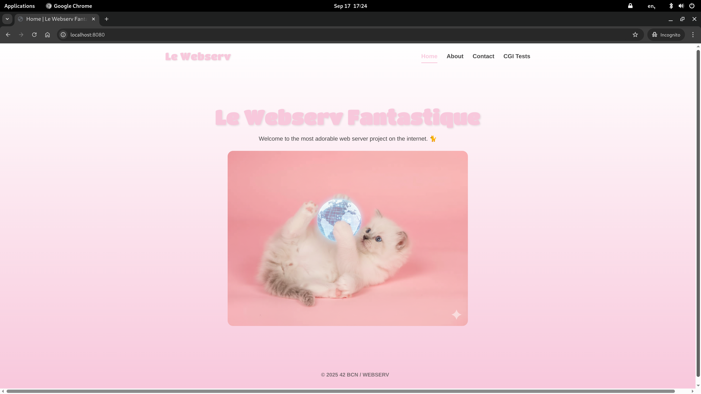
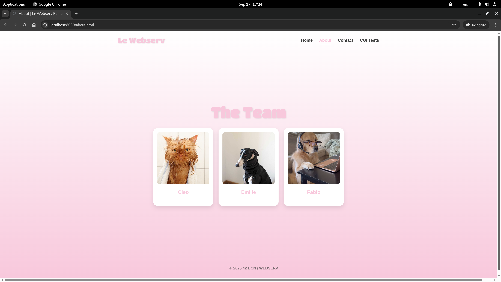
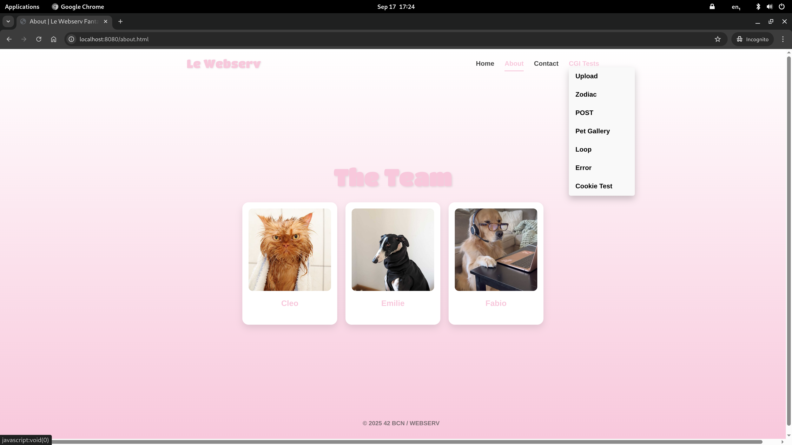
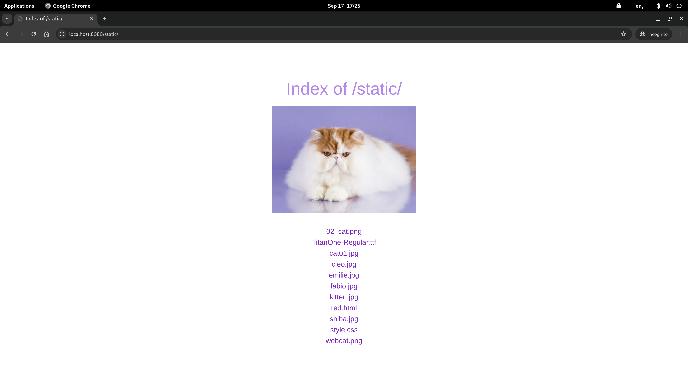

# Webserv

HTTP/1.1 server in C++98 with config parsing, CGI execution, file uploads, and error handling.

## Demo



## Description

Webserv is a custom HTTP/1.1 web server written in C++ (C++98 standard). It reads a configuration file (similar to Nginx) to define server behavior, including port bindings, document roots, location routing, CGI execution, and error handling. The server handles HTTP requests from browsers and other clients, serving static files, processing CGI scripts, and managing file uploads.

This project provides a deep understanding of how web servers work under the hood — from socket creation and request parsing to response generation and CGI integration.

## Technologies & Concepts

- Socket programming (bind, listen, accept, select)
- HTTP/1.1 protocol specification and request parsing
- Configuration file parsing (Nginx-style syntax)
- Concurrent client handling
- CGI (Common Gateway Interface) execution (.py, .php)
- URI routing and location blocks
- Error page handling and custom responses
- Directory listing (autoindex)
- File upload handling with size limits
- Signal handling and graceful shutdown

## How It Works

1. **Server Setup** — Parses the configuration file, extracts server blocks and location blocks. Creates sockets for each `listen` directive and binds to the specified ports.
2. **Client Connection** — Uses `select()` to monitor multiple socket file descriptors. Accepts connections and queues them for processing.
3. **Request Parsing** — Reads the HTTP request, parsing the request line (method, URI, version), headers, and body.
4. **URI Routing** — Matches the request URI against configured `location` blocks with support for exact and prefix matching.
5. **CGI Execution** — If configured, sets environment variables, forks a child process, pipes the request body to stdin, and captures stdout as the response.
6. **Response Generation** — Builds the HTTP response with appropriate status line, headers, and body (file content, CGI output, or error page).
7. **Response Delivery** — Sends the complete HTTP response over the client socket and closes the connection.

## Visuals







## Key Features

- **HTTP/1.1 Compliance** — Full HTTP/1.1 protocol support
- **Configuration File** — Nginx-style config syntax with server blocks and location routing
- **Multiple Server Blocks** — Multiple ports and virtual hosts in one server
- **CGI Support** — Execute Python (.py) and PHP (.php) scripts
- **Method Routing** — Per-location GET, POST, DELETE control
- **Custom Error Pages** — Configurable error page mapping
- **Directory Listing** — Autoindex for browsing directory contents
- **File Uploads** — Handle POST requests with file attachments
- **Redirects** — Support for 301 permanent redirects
- **Client Limits** — Configurable maximum body size
- **Signal Handling** — Graceful shutdown on SIGINT/SIGTERM

## Configuration

The server uses Nginx-style configuration syntax:

```
server {
    listen 8080;
    server_name myserver;
    root /path/to/www;
    index index.html;
    client_max_body_size 1m;

    location / {
        autoindex off;
        allow_methods GET POST;
    }

    location /cgi-bin/ {
        cgi_pass .py /usr/bin/python3;
        cgi_pass .php /usr/bin/php-cgi;
        allow_methods GET POST;
    }

    error_page 404 /error_pages/404.html;
}
```

| Directive           | Description                           |
|---------------------|---------------------------------------|
| `listen`            | Port to bind                          |
| `server_name`       | Server name for virtual hosting       |
| `root`              | Document root directory               |
| `index`             | Default index file                    |
| `client_max_body_size` | Maximum request body size          |
| `location`          | URI path routing block                |
| `autoindex`         | Enable directory listing (on/off)     |
| `allow_methods`     | Allowed HTTP methods                  |
| `cgi_pass`          | CGI script execution                  |
| `error_page`        | Custom error page mapping             |
| `return`            | Redirect                              |

## Project Structure

```
webserv/
├── inc/                     # Header files
├── src/
│   ├── main.cpp             # Entry point
│   ├── ServerManager.cpp    # Server setup and event loop
│   ├── request/             # HTTP request parsing
│   ├── response/            # Response generation and CGI
│   └── Parsing_configuration/ # Config file parser
├── www/                     # Default document root
├── www2/                    # Secondary server root
├── configuration_files/     # Sample configurations
├── Screenshots/             # Server in action
└── Makefile
```

## Team

- [Cleo](https://github.com/CleoLT) — Co-developer
- [EmilieInData](https://github.com/EmilieInData) — Co-developer

## Tech Stack

- **Language:** C++ (C++98 standard)
- **Build:** Make with `-Wall -Wextra -Werror -std=c++98`
- **Networking:** POSIX socket API (bind, listen, accept, select)
- **CGI:** Process forking and piping for script execution

### Links
- [Git Repo](https://github.com/fabbbiodc/webserv)
